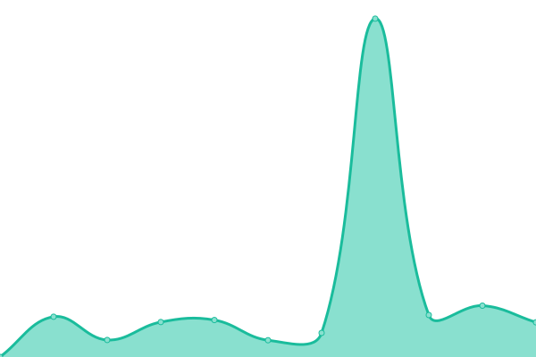
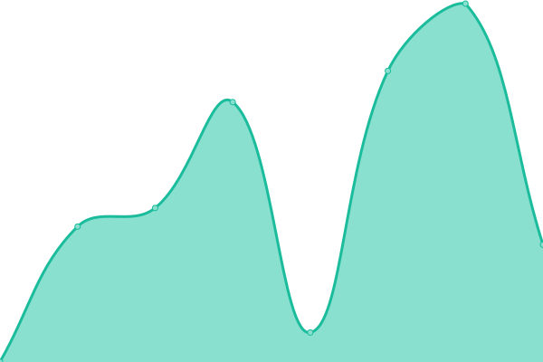
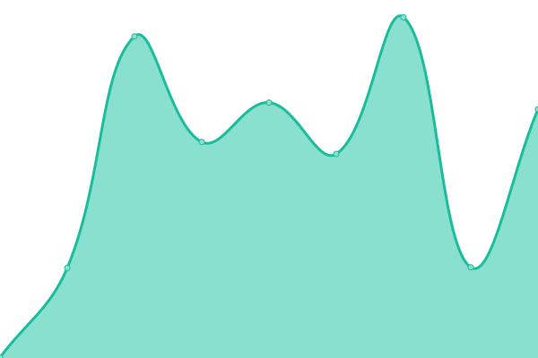
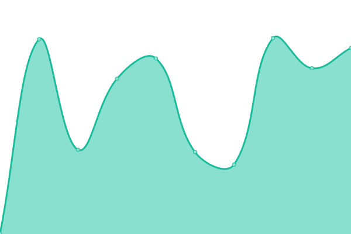

# [📈 Live Status](https://status.acab.enterprises): <!--live status--> **🟩 All systems operational**

This repository contains the open-source uptime monitor and status page for [Dan Staples](https://bpdwatch.com), powered by [Upptime](https://github.com/upptime/upptime).

With [Upptime](https://upptime.js.org), you can get your own unlimited and free uptime monitor and status page, powered entirely by a GitHub repository. We use [Issues](https://github.com/dismantl/acab-status/issues) as incident reports, [Actions](https://github.com/dismantl/acab-status/actions) as uptime monitors, and [Pages](https://status.acab.enterprises) for the status page.

<!--start: status pages-->
<!-- This summary is generated by Upptime (https://github.com/upptime/upptime) -->
<!-- Do not edit this manually, your changes will be overwritten -->
<!-- prettier-ignore -->
| URL | Status | History | Response Time | Uptime |
| --- | ------ | ------- | ------------- | ------ |
|  [Gitlab](https://acab.enterprises) | 🟩 Up | [gitlab.yml](https://github.com/dismantl/acab-status/commits/HEAD/history/gitlab.yml) | 

 865ms
     
 | 

<a href="https://status.acab.enterprises/history/gitlab">100.00%</a>
    

|  [Critical Frequency](https://criticalfrequency.org) | 🟩 Up | [critical-frequency.yml](https://github.com/dismantl/acab-status/commits/HEAD/history/critical-frequency.yml) | 

 1305ms
     
 | 

<a href="https://status.acab.enterprises/history/critical-frequency">100.00%</a>
    

|  [BPD Watch](https://bpdwatch.com) | 🟩 Up | [bpd-watch.yml](https://github.com/dismantl/acab-status/commits/HEAD/history/bpd-watch.yml) | 

 536ms
     
 | 

<a href="https://status.acab.enterprises/history/bpd-watch">100.00%</a>
    

|  [Case Explorer](https://mdcaseexplorer.com) | 🟩 Up | [case-explorer.yml](https://github.com/dismantl/acab-status/commits/HEAD/history/case-explorer.yml) | 

 778ms
     
 | 

<a href="https://status.acab.enterprises/history/case-explorer">100.00%</a>
    

|  [Open Justice Baltimore](https://openjusticebaltimore.org) | 🟩 Up | [open-justice-baltimore.yml](https://github.com/dismantl/acab-status/commits/HEAD/history/open-justice-baltimore.yml) | 

 342ms
     
 | 

<a href="https://status.acab.enterprises/history/open-justice-baltimore">100.00%</a>
    

|  [FORCE](https://upsettingrapeculture.com) | 🟩 Up | [force.yml](https://github.com/dismantl/acab-status/commits/HEAD/history/force.yml) | 

 1132ms
     
 | 

<a href="https://status.acab.enterprises/history/force">100.00%</a>
    

|  [The Monument Quilt](https://themonumentquilt.org) | 🟩 Up | [the-monument-quilt.yml](https://github.com/dismantl/acab-status/commits/HEAD/history/the-monument-quilt.yml) | 

 1725ms
     
 | 

<a href="https://status.acab.enterprises/history/the-monument-quilt">100.00%</a>
    

|  [The Monument Quilt (App)](https://app.themonumentquilt.org) | 🟩 Up | [the-monument-quilt-app.yml](https://github.com/dismantl/acab-status/commits/HEAD/history/the-monument-quilt-app.yml) | 

 437ms
     
 | 

<a href="https://status.acab.enterprises/history/the-monument-quilt-app">100.00%</a>
    

|  The Monument Quilt (Archive) | 🟩 Up | [the-monument-quilt-archive.yml](https://github.com/dismantl/acab-status/commits/HEAD/history/the-monument-quilt-archive.yml) | 

 260ms
     
 | 

<a href="https://status.acab.enterprises/history/the-monument-quilt-archive">100.00%</a>
    

|  [Klaxon](https://klaxon.acab.enterprises) | 🟩 Up | [klaxon.yml](https://github.com/dismantl/acab-status/commits/HEAD/history/klaxon.yml) | 

 517ms
     
 | 

<a href="https://status.acab.enterprises/history/klaxon">100.00%</a>
    

|  [Personal website](https://disman.tl) | 🟩 Up | [personal-website.yml](https://github.com/dismantl/acab-status/commits/HEAD/history/personal-website.yml) | 

 594ms
     
 | 

<a href="https://status.acab.enterprises/history/personal-website">100.00%</a>
    

|  [Nextcloud](https://nextcloud.acab.enterprises) | 🟩 Up | [nextcloud.yml](https://github.com/dismantl/acab-status/commits/HEAD/history/nextcloud.yml) | 

 666ms
     
 | 

<a href="https://status.acab.enterprises/history/nextcloud">100.00%</a>
    

|  [Analytics](https://analytics.acab.enterprises) | 🟩 Up | [analytics.yml](https://github.com/dismantl/acab-status/commits/HEAD/history/analytics.yml) | 

 565ms
     
 | 

<a href="https://status.acab.enterprises/history/analytics">85.73%</a>
    

|  [Plex](https://plex.acab.enterprises/web/index.html) | 🟩 Up | [plex.yml](https://github.com/dismantl/acab-status/commits/HEAD/history/plex.yml) | 

 491ms
     
 | 

<a href="https://status.acab.enterprises/history/plex">100.00%</a>
    

|  [Torrent](https://torrent.acab.enterprises) | 🟩 Up | [torrent.yml](https://github.com/dismantl/acab-status/commits/HEAD/history/torrent.yml) | 

 361ms
     
 | 

<a href="https://status.acab.enterprises/history/torrent">100.00%</a>
    

|  [Movies](https://movies.acab.enterprises) | 🟩 Up | [movies.yml](https://github.com/dismantl/acab-status/commits/HEAD/history/movies.yml) | 

 432ms
     
 | 

<a href="https://status.acab.enterprises/history/movies">100.00%</a>
    

|  [TV](https://tv.acab.enterprises) | 🟩 Up | [tv.yml](https://github.com/dismantl/acab-status/commits/HEAD/history/tv.yml) | 

 370ms
     
 | 

<a href="https://status.acab.enterprises/history/tv">100.00%</a>
    

|  [Jackett](https://jackett.acab.enterprises) | 🟩 Up | [jackett.yml](https://github.com/dismantl/acab-status/commits/HEAD/history/jackett.yml) | 

 458ms
     
 | 

<a href="https://status.acab.enterprises/history/jackett">100.00%</a>
    

<!--end: status pages-->

[**Visit our status website →**](https://status.acab.enterprises)

## 📄 License

- Powered by: [Upptime](https://github.com/upptime/upptime)
- Code: [MIT](./LICENSE) © [Dan Staples](https://bpdwatch.com)
- Data in the `./history` directory: [Open Database License](https://opendatacommons.org/licenses/odbl/1-0/)
